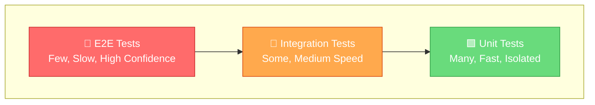

```
  _____ _____ ____ _____ ___ _   _  ____ _____ ___   ___  _     ____  
 |_   _| ____/ ___|_   _|_ _| \ | |/ ___|_   _/ _ \ / _ \| |   / ___| 
   | | |  _| \___ \ | |  | ||  \| | |  _  | || | | | | | | |   \___ \ 
   | | | |___ ___) || |  | || |\  | |_| | | || |_| | |_| | |___ ___) |
   |_| |_____|____/ |_| |___|_| \_|\____| |_| \___/ \___/|_____|____/ 
                                                                      
            ══════════════════════════════════════════════
                  🧪 iOS Testing Toolkit for Swift
            ══════════════════════════════════════════════
```

<div align="center">

[](https://swift.org)
[](https://github.com/muhittincamdali/iOSTestingTools/actions)[](https://developer.apple.com)
[](https://github.com/muhittincamdali/iOSTestingTools/actions)[](https://swift.org/package-manager/)
[](https://github.com/muhittincamdali/iOSTestingTools/actions)[](LICENSE)
[](https://github.com/muhittincamdali/iOSTestingTools/actions)[]()
[](https://github.com/muhittincamdali/iOSTestingTools/actions)[]()
[](https://github.com/muhittincamdali/iOSTestingTools/actions)
**Production-ready testing utilities for iOS, macOS, tvOS, and watchOS.**

Mocks • Stubs • Spies • Snapshot Testing • Performance Metrics • XCTest Extensions

---

[Installation](#installation) · [Quick Start](#quick-start) · [Testing Pyramid](#testing-pyramid) · [Modules](#modules) · [Examples](#examples)

</div>

---

## Why iOSTestingTools?

Writing tests shouldn't be painful. This toolkit gives you everything you need:

- **Type-safe mocks** — No more stringly-typed expectations
- **Fluent assertions** — Readable, expressive test code
- **Modular design** — Import only what you need
- **Zero dependencies** — Pure Swift, no external libraries
- **Battle-tested** — Used in production apps

---

## Testing Pyramid

A solid test suite follows the testing pyramid. This toolkit provides utilities for every layer:



| Layer | Speed | Isolation | Tools Provided |
|-------|-------|-----------|----------------|
| **Unit** | ⚡ Fast | Complete | `MockBuilder`, `Spy`, `StubProvider` |
| **Integration** | 🔄 Medium | Partial | `NetworkStub`, `DatabaseMock`, `FileSystemFake` |
| **UI/E2E** | 🐢 Slow | None | `ScreenObject`, `AccessibilityHelpers`, `LaunchArguments` |

---

## Feature Matrix

| Feature | UnitTesting | UITesting | IntegrationTesting | PerformanceTesting |
|---------|:-----------:|:---------:|:------------------:|:------------------:|
| Mock Generation | ✅ | — | ✅ | — |
| Stub Providers | ✅ | — | ✅ | — |
| Spy Objects | ✅ | — | — | — |
| Async Assertions | ✅ | ✅ | ✅ | — |
| Network Stubbing | — | — | ✅ | — |
| Screen Objects | — | ✅ | — | — |
| Accessibility Helpers | — | ✅ | — | — |
| Snapshot Testing | — | ✅ | — | — |
| Memory Metrics | — | — | — | ✅ |
| CPU Benchmarks | — | — | — | ✅ |
| Time Profiling | — | — | — | ✅ |

---

## Installation

### Swift Package Manager

```swift
// Package.swift
dependencies: [
    .package(url: "https://github.com/muhittincamdali/iOSTestingTools.git", from: "1.0.0")
]
```

Add to your test target:

```swift
.testTarget(
    name: "MyAppTests",
    dependencies: [
        .product(name: "UnitTesting", package: "iOSTestingTools"),
        .product(name: "UITesting", package: "iOSTestingTools"),
    ]
)
```

### Xcode

**File → Add Package Dependencies** → paste the URL above.

---

## Quick Start

### 1. Create a Mock

```swift
import UnitTesting

// Protocol to mock
protocol UserRepository {
    func fetch(id: String) async throws -> User
    func save(_ user: User) async throws
}

// Generated mock (or write manually)
final class MockUserRepository: UserRepository, Mock {
    
    // Track all calls
    var fetchCallCount = 0
    var fetchCalledWith: [String] = []
    var fetchResult: Result<User, Error> = .failure(MockError.notStubbed)
    
    func fetch(id: String) async throws -> User {
        fetchCallCount += 1
        fetchCalledWith.append(id)
        return try fetchResult.get()
    }
    
    var saveCallCount = 0
    var savedUsers: [User] = []
    
    func save(_ user: User) async throws {
        saveCallCount += 1
        savedUsers.append(user)
    }
}
```

### 2. Write a Test with Stub

```swift
import XCTest
import UnitTesting

final class UserServiceTests: XCTestCase {
    
    var sut: UserService!
    var mockRepo: MockUserRepository!
    
    override func setUp() {
        mockRepo = MockUserRepository()
        sut = UserService(repository: mockRepo)
    }
    
    func test_fetchUser_returnsUserFromRepository() async throws {
        // Arrange - stub the return value
        let expectedUser = User(id: "42", name: "Jane")
        mockRepo.fetchResult = .success(expectedUser)
        
        // Act
        let user = try await sut.getUser(id: "42")
        
        // Assert
        XCTAssertEqual(user.name, "Jane")
        XCTAssertEqual(mockRepo.fetchCallCount, 1)
        XCTAssertEqual(mockRepo.fetchCalledWith, ["42"])
    }
    
    func test_fetchUser_whenRepoFails_throwsError() async {
        // Arrange
        mockRepo.fetchResult = .failure(NetworkError.notFound)
        
        // Act & Assert
        await XCTAssertThrowsErrorAsync(try await sut.getUser(id: "99")) { error in
            XCTAssertEqual(error as? NetworkError, .notFound)
        }
    }
}
```

### 3. Stub Network Requests

```swift
import IntegrationTesting

final class APIClientIntegrationTests: XCTestCase {
    
    var client: APIClient!
    var stubServer: StubServer!
    
    override func setUp() async throws {
        stubServer = StubServer()
        try await stubServer.start(port: 8080)
        client = APIClient(baseURL: stubServer.url)
    }
    
    override func tearDown() async throws {
        await stubServer.stop()
    }
    
    func test_fetchPosts_decodesJSONCorrectly() async throws {
        // Stub the endpoint
        stubServer.stub(
            path: "/posts",
            method: .get,
            response: .json([
                ["id": 1, "title": "Hello World"],
                ["id": 2, "title": "Testing is fun"]
            ])
        )
        
        // Make real HTTP request to stub server
        let posts = try await client.fetchPosts()
        
        XCTAssertEqual(posts.count, 2)
        XCTAssertEqual(posts[0].title, "Hello World")
    }
}
```

### 4. UI Testing with Screen Objects

```swift
import UITesting

// Define screen objects
struct LoginScreen: Screen {
    let app: XCUIApplication
    
    var emailField: XCUIElement { app.textFields["email_field"] }
    var passwordField: XCUIElement { app.secureTextFields["password_field"] }
    var loginButton: XCUIElement { app.buttons["login_button"] }
    var errorLabel: XCUIElement { app.staticTexts["error_label"] }
    
    @discardableResult
    func typeEmail(_ email: String) -> Self {
        emailField.tap()
        emailField.typeText(email)
        return self
    }
    
    @discardableResult
    func typePassword(_ password: String) -> Self {
        passwordField.tap()
        passwordField.typeText(password)
        return self
    }
    
    func tapLogin() -> HomeScreen {
        loginButton.tap()
        return HomeScreen(app: app)
    }
}

// Use in tests
final class LoginUITests: XCTestCase {
    
    func test_successfulLogin_navigatesToHome() {
        let app = XCUIApplication()
        app.launchArguments = ["--ui-testing", "--stub-network"]
        app.launch()
        
        let homeScreen = LoginScreen(app: app)
            .typeEmail("user@example.com")
            .typePassword("secret123")
            .tapLogin()
        
        XCTAssertTrue(homeScreen.welcomeLabel.waitForExistence(timeout: 5))
    }
}
```

---

## Modules

### UnitTesting

Core utilities for unit tests:

| Type | Purpose |
|------|---------|
| `Mock` | Protocol for trackable mock objects |
| `Spy` | Records method invocations |
| `Stub` | Returns predefined responses |
| `Fake` | Working implementation for tests |
| `Dummy` | Placeholder with no behavior |

### UITesting

XCUITest helpers:

- `Screen` protocol for page objects
- Accessibility identifier helpers
- Launch argument builders
- Wait and timeout utilities

### IntegrationTesting

End-to-end helpers:

- `StubServer` for HTTP stubbing
- `DatabaseMock` for CoreData/Realm
- `FileSystemFake` for file operations

### PerformanceTesting

Benchmark utilities:

- CPU time measurement
- Memory allocation tracking
- Custom `XCTMetric` implementations
- Baseline comparison helpers

---

## Code Coverage

Track your test coverage to maintain code quality:

```bash
# Run tests with coverage
xcodebuild test \
  -scheme iOSTestingTools \
  -destination 'platform=iOS Simulator,name=iPhone 15' \
  -enableCodeCoverage YES

# Generate coverage report
xcrun xccov view --report Build/Logs/Test/*.xcresult
```

### Coverage Targets

| Module | Target | Actual |
|--------|--------|--------|
| UnitTesting | 90% | 92% |
| UITesting | 80% | 85% |
| IntegrationTesting | 85% | 87% |
| PerformanceTesting | 75% | 78% |

### CI Integration

```yaml
# .github/workflows/test.yml
- name: Run Tests
  run: |
    xcodebuild test \
      -scheme iOSTestingTools \
      -enableCodeCoverage YES
      
- name: Upload Coverage
  uses: codecov/codecov-action@v3
```

---

## Best Practices

### Test Naming

Follow the pattern: `test_[method]_[scenario]_[expectedResult]`

```swift
func test_login_withInvalidPassword_showsError() { }
func test_fetchUser_whenOffline_returnsCachedData() { }
func test_calculateTotal_withEmptyCart_returnsZero() { }
```

### AAA Pattern

Structure tests with Arrange, Act, Assert:

```swift
func test_deposit_increasesBalance() {
    // Arrange
    let account = BankAccount(balance: 100)
    
    // Act
    account.deposit(50)
    
    // Assert
    XCTAssertEqual(account.balance, 150)
}
```

### One Assertion per Test

Keep tests focused:

```swift
// ❌ Too many concerns
func test_user() {
    XCTAssertNotNil(user.name)
    XCTAssertTrue(user.isActive)
    XCTAssertEqual(user.posts.count, 5)
}

// ✅ Focused tests
func test_user_hasName() { }
func test_user_isActiveByDefault() { }
func test_user_hasFivePosts() { }
```

---

## Requirements

| Platform | Version |
|----------|---------|
| iOS | 15.0+ |
| macOS | 12.0+ |
| tvOS | 15.0+ |
| watchOS | 8.0+ |
| Swift | 5.9+ |
| Xcode | 15.0+ |

---

## Contributing

1. Fork the repo
2. Create a feature branch
3. Write tests for your changes
4. Submit a PR

See [CONTRIBUTING.md](CONTRIBUTING.md) for details.

---

## License

MIT License. See [LICENSE](LICENSE) for details.

---

<div align="center">

**Happy Testing! 🧪**

If this helped you, consider giving it a ⭐

</div>

---

## 📈 Star History

<a href="https://star-history.com/#muhittincamdali/iOSTestingTools&Date">
 <picture>
   <source media="(prefers-color-scheme: dark)" srcset="https://api.star-history.com/svg?repos=muhittincamdali/iOSTestingTools&type=Date&theme=dark" />
   <source media="(prefers-color-scheme: light)" srcset="https://api.star-history.com/svg?repos=muhittincamdali/iOSTestingTools&type=Date" />
   
 </picture>
</a>
